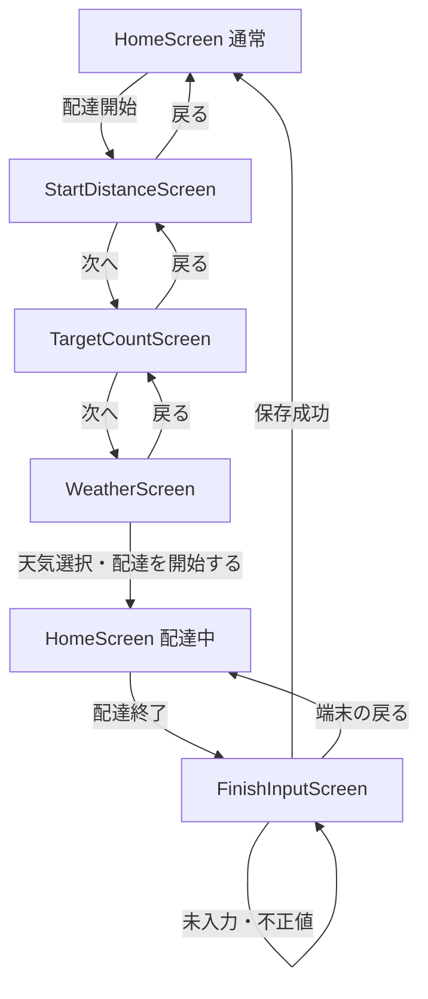

# 画面遷移

```mermaid
graph TD
    Home[HomeScreen 通常] -->|配達開始| StartDistance[StartDistanceScreen]
    StartDistance -->|次へ| TargetCount[TargetCountScreen]
    TargetCount -->|次へ| Weather[WeatherScreen]
    Weather -->|天気選択・配達を開始する| Delivering[HomeScreen 配達中]
    Delivering -->|配達終了| FinishInput[FinishInputScreen]
    FinishInput -->|保存成功| Home
    FinishInput -->|未入力・不正値| FinishInput
    FinishInput -->|端末の戻る| Delivering
    StartDistance -->|戻る| Home
    TargetCount -->|戻る| StartDistance
    Weather -->|戻る| TargetCount
```

## 補足

- 配達中専用の別画面は作らず、HomeScreen の状態（通常／配達中）で表示を切り替える。
- HomeScreen 下部の履歴・設定は選択状態のみ変更する現状で、各画面への接続は未完了。
- 開始距離・目標件数の変更操作は UI 未接続のため、図では確認・次へとして扱っている。
