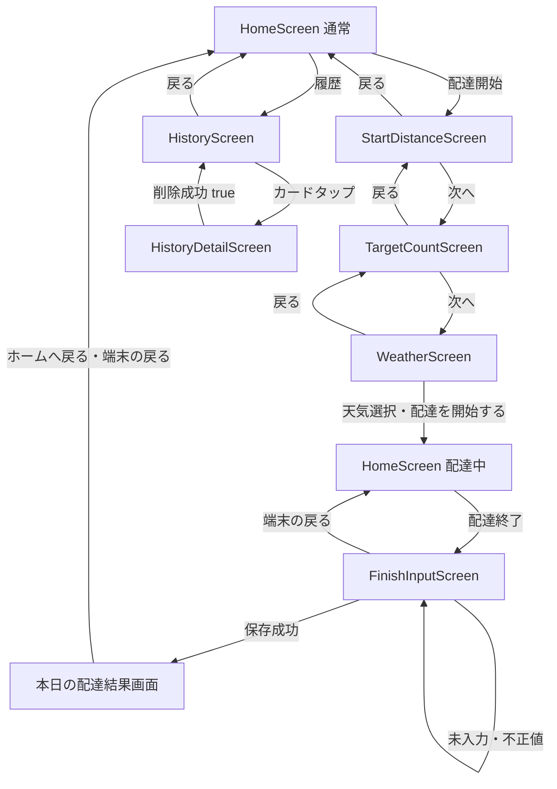

# 画面遷移

## 補足

- 配達中専用の別画面は作らず、HomeScreen の状態（通常／配達中）で表示を切り替える。
- 保存成功時は FinishInputScreen を本日の配達結果画面へ置き換え、FinishInputResult を HomeScreen に返す。結果画面から戻ると、当日データを保持した HomeScreen の通常モードを表示する。
- FinishInputScreen は置き換え済みのため、結果画面で端末の戻る操作を行っても終了入力へ戻らず、再保存や二重保存は発生しない。
- HomeScreen 下部の履歴・設定から各画面へ遷移し、戻った際に集計を再読込する。
- 配達開始確定時にDeliverySessionを一時保存し、起動時に保存済みセッションがあればHomeScreen配達中モードを復元する。
- 履歴詳細で削除成功後はHistoryScreenが戻り値を検知して一覧を再読込し、HomeScreenへ戻ると日・週・月集計を再読込する。
- 開始距離・目標件数の変更操作は UI 未接続のため、図では確認・次へとして扱っている。
